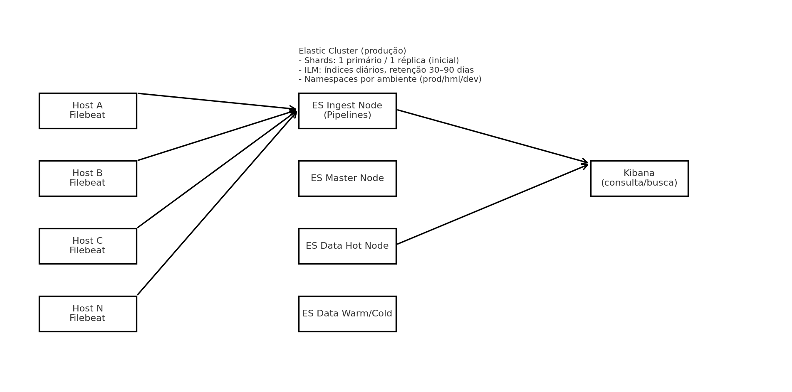
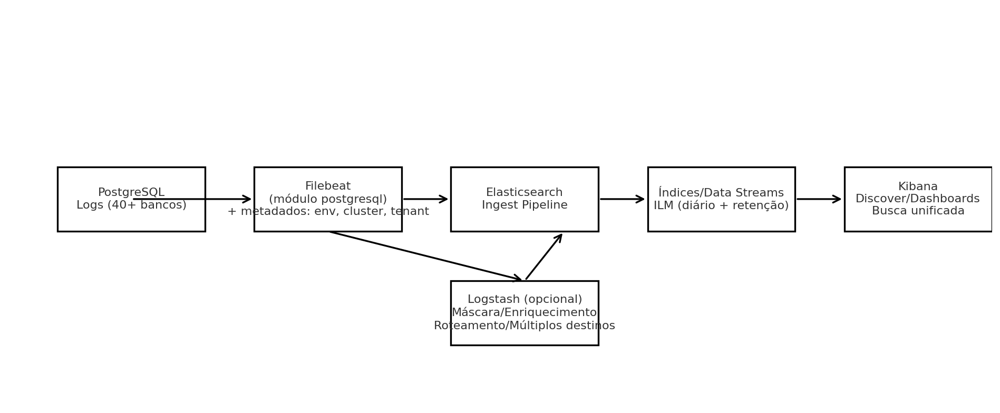

# Centralização e Análise de Logs do PostgreSQL com Elastic Stack

Este repositório descreve e documenta um projeto para coletar, indexar e buscar logs de **40+ bancos PostgreSQL** com **Filebeat → Elasticsearch → Kibana**.
Métricas/monitoramento não estão inclusas, há um outro projeto para monitoramento de banco de dados aqui no perfil, utilizando Prometheus+Grafana.

## Arquitetura



## Fluxograma da Integração



## Objetivos
- Centralizar logs por ambiente (prod/hml/dev) em índices diários.
- Permitir buscas unificadas por banco/usuário/severidade/tenant.
- Aplicar retenção com ILM (30–90 dias) e boas práticas de shards.
- Operação simples (preferência por Filebeat → ES Ingest).

## Estrutura do Repositório
```
/docs
  /images
/config
/infra
/examples
README.md
LICENSE
```

## Como usar esta documentação
1. Leia o PDF em `docs/Documentacao_Projeto_Log_PostgreSQL_ElasticStack.pdf` para visão completa (requisitos, design, etapas, checklists).
2. Adapte `config/` com suas políticas de ILM e templates de índice.
3. Provisione a infraestrutura descrita em `infra/`.
4. Instale e configure o Filebeat em cada host de PostgreSQL.
5. Crie data views no Kibana e valide a ingestão.

---

> O repositório não contém segredos nem chaves. Mantenha credenciais em cofres apropriados (ex.: Vault).

